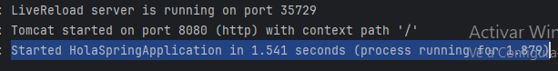
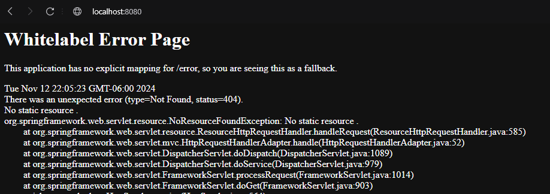
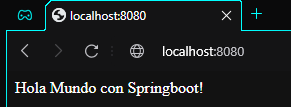
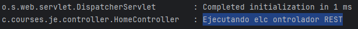
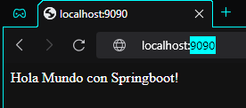
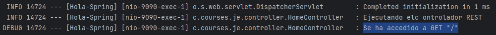
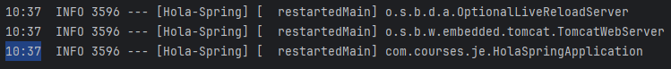

# Seccion 2
## Hola Mundo con Springboot

### Plugins Springboot
- Existen plugins de Spring que permiten la creaciond e proyectos springboot desde el IDE
- Revisa los plugins en el marketplace de tu IDE
- En caso de que al crear el proyecto, no se hayan descargado las dependencias y marque error el el folder raiz, usar clean & build en el proyecto para descargar las dependencias
- La siguiente carpeta es la que contiene todas las librerias de maven : `C:\Users\User\.m2`
- En el caso de que aun se marque error, hay que cerrar el IDE y eliminar la carpeta `repository` dentro de la ruta anteriormente menciona, finalmente, abrimos el IDE de nuevo

### pom.xml
- En este archivo podemos observar las dependencias de nuestro proyecto
- La dependencia padre es la dependencia de springboot
- Las depepndencias hijas dependen de la dependencia padre, como la padre es la de Springboot, la hija podria ser thymeleaf por ejemplo
- Todas ellas perteneces al mismo groupId: `org.springframework.boot`

### Main class
- Nuestra clase `HolaMundoApplication.java` contiene el metodo main.
- A su vez, esta clase esta anotada con `@SpringbootApplication`
- Al entrar a esa anotacion, podemos ver como hay otras anotaciones mas que son las que facilitan la configuracion del proyecto
- Para ejecutar la aplicacion basta con entrar a la clase y darle en correr el archivo actual

- Ahora podremos acceder a nuestra aplicacion usando el la direccion local y el puerto
- Veremos una pantalla de error dado que no hemos definido alguna pantalla de error especifica, pero con eso se comprueba que la app esta corriendo

### Spring
- Spring es un contenedor de clases java
- A estas clases tambien se les conocen como `beans`

### Controlador REST
- El controlador nos va a permitir enviar informacion al navegador, en este caso, utilizaremos el GET
- Ya que Spring es un contenedor de clases java, es necesario crear el controlador dentro del mismo paquete en que se encuentra nuestra clase principal: `com.courses.je`

### Anotaciones
- La anotacion `@ComponentScan` dentro de `@SpringbootApplication` es la que se encarga de buscar las clases dentro del mismo paquete (contenedor)
- Si creamos clases fuera de ese paquete, no las va a reconocer
- Nuestra clase controlador `HomeController.java` debe estar anotada con `@RestController` para que Spring pueda reconocerla
- @RestController tiene dentro `@Controller`, que a su vez tiene `@Component`. Esto le permite al `@ComponentScan` detectar la clase como clase del contenedor
- Hemos anotado con `@GetMapping` el metodo del controlador agregando la ruta `/` para que sea el metodo que se ejecute al correr la aplicacion, que en este caso, solo retorna un string!
 
- La anotacion `@Slf4J` viene de parte de lombok y es para agregar logging a nuestras clases

### Archivo de configuracion de la aplicacion
- Dentro de `Hola-Spring\src\main\resources` se encuentra el archivo `application.properties`
- Este archivo es en el que podemos customizar las configuraciones de la aplicacion.
- Inicialmente se encuentra vacio dado que estan aplicadas las configuraciones por default
- Hemos cambiado el puerto de la aplicacion a `9090`
- Tambien el nivel de loggeo de la aplicacion en general, aunque tambien se puede hacer a nivel de paquete usando `logging.level.[Paquete]`
- Ahora podemos acceder al nivel debug dentro de nuestro controlador:

- Por ultimo, hemos configurado el patron de fecha del log para que solo mande la hora y el minuto en lugar de toda la fecha, esto con `logging.pattern.dateformat=hh:mm`
