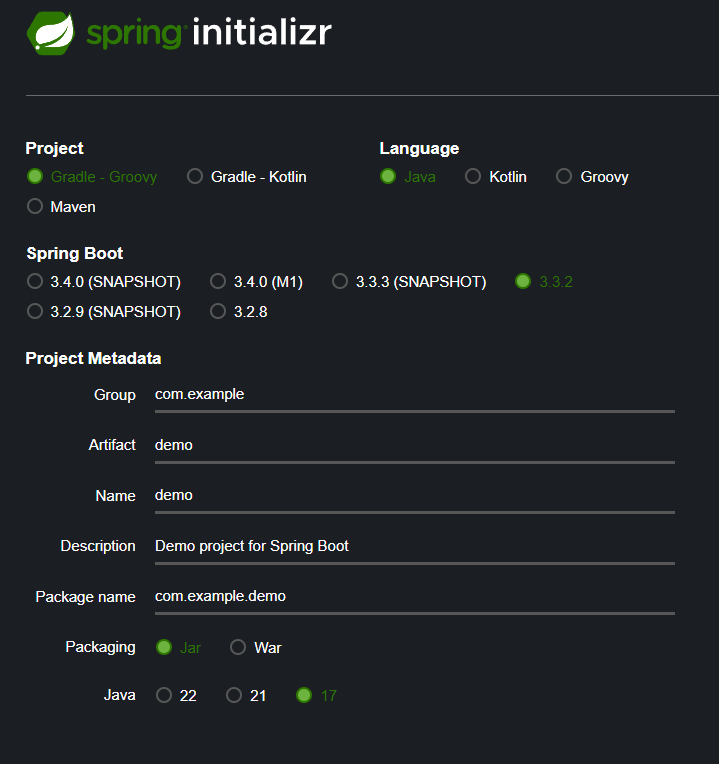
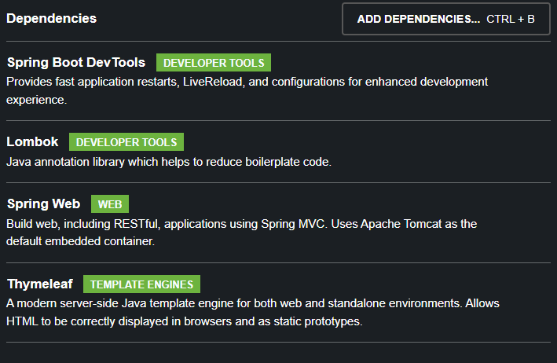

# Seccion 2
## Creacion de proyecto con Spring Initilizr

Spring Initilizr: https://start.spring.io

Esta pagina permite crear proyectos de spring utilizando las caracteristicas que nos brinda, por ejemplo
- Utilizar Maven / Gradle (administradores de dependencias)
- Tambien permite seleccionar el lenguaje de nuestra preferencia como Java, Kotlin y Groovy
- Permite seleccionar la versiond e SPring que queramos utilizar 
- Finalmente, permite modificar los detalles del proyecto como su nombre, grupo, artifact, descripcion, etc

Para fines de este ejercicio, hemos agregado las siguientes dependencias:

### Estructura de projecto
- Nuestro proyecto contiene varias carpetas dentro de las cuales, la principal sera la carpeta "main"
- Contiene la carpeta "java"/"src" donde se alojan os archivos de nuestro programa
- La carpeta "resources" contiene la configuracion de nuestro proyecto
- Dentro de "resources" podremos ver la carpeta de "templates" que aloja las plantillas de Thymeleaf qure utilizaremos para nuestra pagina Web
- El archivo "application.properties" contiene las configuraciones de nuestra aplicacion Spring
- Finalmente, contiene la clase principal de nuestra aplicacion mediante la cual podremos ejecutar la misma; "HolaSpringApplication.java"