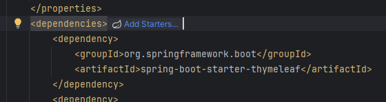
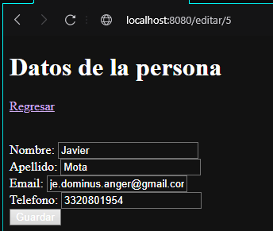

# Seccion 3
## Clase de dominio "Persona"

### Clases de dominio
- Estas clases son las que se comparten entre BE y FE en los endpoints y tienen su propio paquete
- Se ha creado una clase Persona que contendra 4 atributos, nombre, apellido, telefono y email

### Lombok
- Tradicionalmente se le agregaban los metodos set y get a cada atributo de la clae de dominio manualmente
- Con la libreria de `lombok` podemos agregar anotaciones que nos permite generar ese codigo sin evrlo en la clase
- `@Data`: contiene varios de las anotacion de lombok como `toString`, `hasCode`, `equals`, `@Getters` y `@Setters`
- `@AllArgsConstructor`: Permite el llamado de un constructor con todas las propiedades como parametro
- `@NoArgsConstructor`: Permite el llamado de un constructor sin parametros
- `@Builder`: Permite el instanciamiento de la clase con el patron builder
- `@Accessors(chain = true)`: permite acceder a los atributos en cadena con la notacion del punto

### Vista
- De igual manera que los atributos anteriores, se puede agregar el objeto persona al objeto `Model`
- Ahora la plantilla thymeleaf puede accedr al objeto y sus atributos con la notacion del punto: `th:text="${persona.firstName}"`
- Una vez hecho esto, ya podemos observar los atributos del objeto en la vista

### Arquitectura Spring MVC
