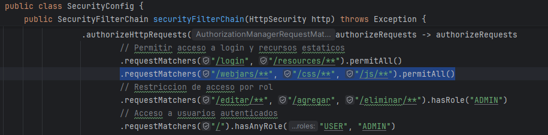

# Seccion 3
## Spring Data

### Introduccion
- Anteriormente creamos un objeto de dominio `Persona` e instanciamos multiples objetos para mostrarlos en la vista de thymeleaf
- Tambien hemos creado una Base de datos `test` con la tabla `Persona` y algunos registros.
- En esta leccion vamos a configurar  `Spring Data Source` en `application.properties`
- Tambien vamos a manejar operaciones con la base de datos y thymeleaf

### Librerias
- Nos faltan las librerias de `SpringData`, para ello iremos al `pom.xml` y seleccionamos agregar starter

- Buscamos las librerias de `Spring Data JPA` y `MySQL Driver` y la agregamos 

- Finalmente damos un maven update para que se descargen si es que marca error

### Configuracion de Data Source
- A la hora de importar la libreria de `Spring Data` es posible ver un error de data source dado que al correr la aplicacion se espera que ya se haya registrado la BD

- Para solucionar esto, hay que ir a `application.properties` y configurar lo sighuiente:

- Con esto configurado, ya podremos inicializar nuestra aplicacion

