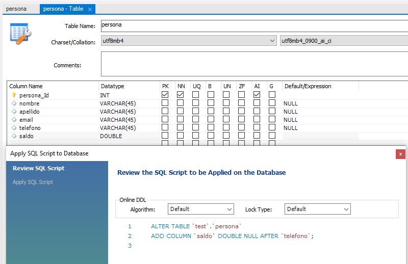
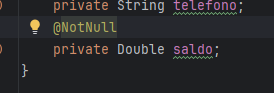
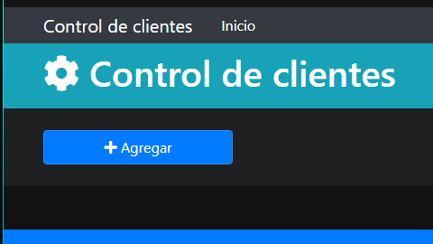

# Seccion 12
## Aplicacion final

### Vista general
- Login

- Incio

- Crear cliente

- Lista de clientes

- Editar cliente

________________________________

### Librerias Bootstrap, FontAwesome y WebJar
- `Bootstrap`: Mejoras visuales de elementos html
- `FontAwesome`: Iconografia
- `WebJar`: contiene librerias como FontAwesome, JQuery, etc
  - Es necesario agregarla si es que vamos a agregar bootstrap y fontawsome de la siguiente manera

### Agregar librerias a las plantillas HTML
- Las librerias de mejopras visuales deben de incluirse dentro de etiquetas `link` y especificando la ruta de la libreria
  - En este caso, `Bootstrap` y `font-awesome`
- Por otro lado, es necesario agregar librerias de `JavaScript` para el buen manejo de las librerias visuales
- Estas van dentro de una etiqueta `script`
  - Agregaremos `JQuery`, `Popper` y `Bootstrap` de JS
- Ahora debemos especificar que nuestro elemento `head` sea un fragmento de thymeleaf para que los demas html compartan esta configuracion

- Finalmente incrustamos la configuracion del head en las demas plantillas html

- Una vez configurado, podremos ver que la fuente de nuestras pantallas ha cambiado, dado que esta es una caracteristica de bootstrap y demuestra que se ha implementado correctamente

- En caso de haber errores con la carga de los scripts, es posible tener que agregar los permisos a SpringSecurity para acceder a esos recursos:

### Barra de navegacion
- Vamos a modificar la etiqueta `header` de la `plantilla.html`
  - `<nav class="navbar navbar-expand-sm navbar-dark bg-dark p-0"></nav>`
  - todas als configuraciones de `class` pueden consultarse en el sitio oficial de bootstrap
- Bootstrap maneja el concepto `mobile-first`
  - Esto indica que siempre ajustara sus componentes para que sean utilizados en dispositivos moviles, y despues a navegadores mas grandes
- Se ha agregado un navbar
  - Este navbar contiene un ancla a nuestra pagina de inicio `/`
  - Tambien contiene un boton `toggler` que permite mostrar el menu colapsable en celulares
  - el `span` contiene el icono del menu colapsable
- En el siguiente contenedor se contendra el menu desplegable, por lo que hay que referenciar el id del boton que lo despliega `navbarCollapse`
- La segunda lista de la barra solo se muestra si se encuentra autenticado el usuario
  - Para ello se utiliza la etiqueta de spring security
- Configuracion final del header

- Vista en resolucion de ordenador 

- Menu desplegable en version movil

### Header (nav arte 2) y Footer 
- Se ha agregado en el header la parte del titulo con la siguiente configuracion:

- Para el footer agregaremos clases de bootstrap para cambiar su apariencia 

### Pagina de login
- Ademas de las plantillas de navbar, header y footer, se han hecho las siguiente mejoras al login 

### Modificacion de tabla Persona (campo Saldo)
- Hemos agregado una nueva columna  ala entidad de persona para saber cuanto saldo debe

- Por lo tanto hay que agregarlo en la entidad `Persona.java`
- Se agrega la anotacion `@NotNull` dado que no es un string

### Listado de personas - Agregar persona
- Mantendremos el header y el footer
- Pero vamos a agregar una plantilla para
  - Seccion de botones de agregar
  - Manejo de agregar
  - listar clientes
- Crearemos la plantilla `botonesAgregar.html` en `layout`

### Listado de personas - Listado clientes
- Ir a listadoClientes.html para mas detalles

