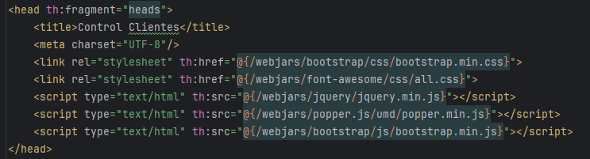

# Seccion 3
## Compartir Informacion Spring MVC con Thymeleaf

### Spring MVC
- Se requieren cambios en el controlador para permitir el envio de informacion hacia la plantilla de thymeleaf
- Al trabajar con Servlets se recibia en el metodo del controlador el `HttpServletRequest` y `HttpServletResponse`
- Esto nos permitia tener al alcance del archivo html, los objetos: `request`, `application` y `session`

### Modelo
- Con spring, aunque es posible recibir el `HttpServletRequest`, vamos a recibir el objeto `Model`
- **La clase `Model` permite agregar la informacion quer queremos compartir con la vista**
- Por ejemplo, la variable `mensaje`, se crea en el controlador y se envia a la vista mediante el objeto model
- Para agregar dicha variable, es necesario utilizar `.addAttribute` con su sobrecarga de mapa `(String, object)`

### Injeccion de dependencias
- Spring maneja el concepto de inyecciond e dependencias
- La clase `@Controller`, es una clase que ya esta incluida en la fabrica de spring (SpringFactory). 
- Esto permite que en los metodos de tipo mapping (`@GetMapping`...) podamos recibir diferentes argumento solo con declararlos, como el argumento `Model`
- Tambien permite recibir mas parametros y en distinto orden, es parte de la flexibilidad de spring

### Principio de Hollywood
- "No me llames, yo te voy a llamar"
- Siginifica que nosotros no tenemos que instanciar la clase `Model`
- La fabrica de spring se va a encargar de crear las instancias y nos las regresa de forma automatica para que nosotros solo las llamemos, como en el casod e la instancia `model`
- Inversion de control

### Vista
- Para recuperar el valor del lado de la vista utilizamos `expression language` parecido al de `jsp`
- usamos el componente de thymeleaf e invocamos la variable con el nombre que se le agrego al modelo en el controlador: `th:text=${mensaje}`

- Esta informacion dinamica permite cambiar los valores desde el controlador sin modificar el archivo `html`

### Valores predefinidos
- Tambien se pueden agregar valores predefinidos en el archivo `application.properties` y llamar a ese valor en el controlador MVC
- Para ello se requiere de la declaracion de la variable y la anotacion `@Values` de spring con `expression language` y el nombre de nuestra propiedad: `index.saludo`
- Ahora solo resta agregar la variable al `Modelo` y recuperarla en la vista de la misma forma que la anterior

### Extras
- `LiveReload` es un plugin de Chrome que permite el refresh automatico