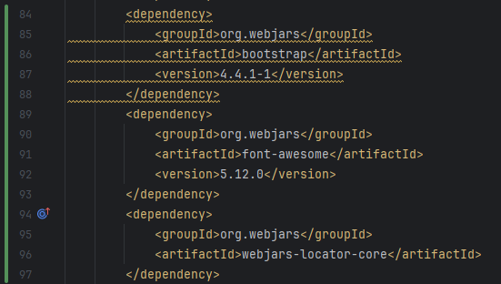

# Seccion 6
## CRUD Editar

### Vista - index.html
- Comenzamos por agregar una nueva columna en la tabla para pdoer editar un registro
- `<a th:href="@{/editar/} + ${persona.persona_id}">Editar</a>`
  - `@{/editar/}` es el path de nuestro controlador
  - `+ ${persona.persona_id}` es el `pathVariable` que señala que `Persona` vamos a edita
- Por lo tanto al controlador le debe llegar por ejemplo un `/edita/1`
- Podemos observar que el nuevo campo editar ya se encuentra en la tabla

### Controlador - /editar/{personaId}
- Se agrega un `@GetMapping` con el path `editar/{personaId}`
- Se agrega como argumento el objeto `Persona`
- Spring asocia el objeto inyectado persona con el `pathVariable` `personaId` y crea una instancia del objeto con ese id, por lo que no hay que setearlo de nuevo
- Ahora podemos usar el objeto `Persona` con el `personaId` que se le ha pasado
- Tambien necesitamos agregar `Model` para compartir los cambios con la siguiente peticion
- Vamos al servicio a buscar el objeto persona con el Id que nos han pasado
- Lo agregamos al modelo y retornamos la vista `modificar`

### Vista - modificar
- **A la hora de que la vista toma el objeto compartido en el modelo, el formulario lee los campos del objeto que se ha retornado (`persona`) y llena cada uno de los campos del formulario con sus valores actuales**
- Por lop que ya no es necesario hacer ningun cambio para agregar los valores actuales del objeto recuperado al formulario
- Al acceder a editar un registro, podemos ver que el endpoint ya contiene el id de la persona `5`
- Tambien que los campos estan llenos con la informacion actual

- Ahora modificaremos la informacion de la persona

- Observamos los cambios deplegados en la pagina de inicio
- Sin embargo, de momento no esta modificando la informacion de la persona actual, si no que esta creando un registro completamente nuevo
- Se puede observar que el registro a modificar, sigue en la lista, y los valores modificados se insertaron como registro nuevo

- Esto se debe a que nuestro formulario no se ha especificado el valor del atributo `personaId`
- Por lo que al presionar el boton, se ejecuta el `POST /guardar` y al no detectar el Id, hibernate lo toma como un objeto nuevo
- Para solucionar esto hay que agregar un campo oculto que lea el Id si es que existe:
  - `<input type="hidden" name="personaId" th:field="*{personaId}" />  `
  - Esto permite que cuando sea un registro nuevo, al no haber Id, se crea el registro
  - Al igual que se cargan los inputs si existe la informacion, el Id se cargara en el campo oculto y en lugar de crear, modificara el registro existente
- Ahora ya es posible modificar la informacion de `Javier Mota` sin que se guarde un registro nuevo
- Confirmamos en la consola que la operacion realizada sea un update

