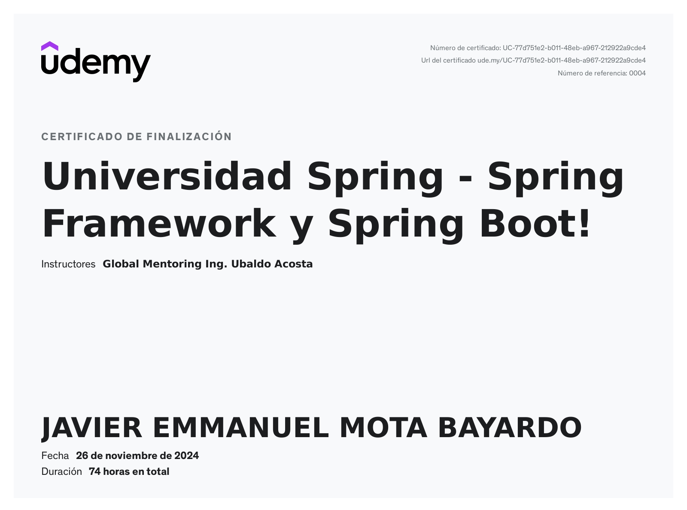

# Universidad Spring
## Spring Framework & Springboot

- Este repositorio se encuentra gestionado por ramas que contienen notas, cambios e ilustraciones de lo visto en cada una de las lecciones.
- Las notas de cada leccion se pueden encontrar en el archivo `readme.md` en su respectiva rama.
- Encuentre mas abajo el certificado otorgado por Udemy al completar el curso.
___________
## Udemy Completion Certificate

