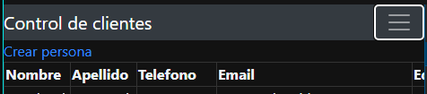

# Seccion 4
## Spring Data

### Introduccion
- Anteriormente creamos un objeto de dominio `Persona` e instanciamos multiples objetos para mostrarlos en la vista de thymeleaf
- Tambien hemos creado una Base de datos `test` con la tabla `Persona` y algunos registros.
- En esta leccion vamos a configurar  `Spring Data Source` en `application.properties`
- Tambien vamos a manejar operaciones con la base de datos y thymeleaf

### Librerias
- Nos faltan las librerias de `SpringData`, para ello iremos al `pom.xml` y seleccionamos agregar starter

- Buscamos las librerias de `Spring Data JPA` y `MySQL Driver` y la agregamos 

- Finalmente damos un maven update para que se descargen si es que marca error

### Configuracion de Data Source
- A la hora de importar la libreria de `Spring Data` es posible ver un error de data source dado que al correr la aplicacion se espera que ya se haya registrado la BD

- Para solucionar esto, hay que ir a `application.properties` y configurar lo sighuiente:

- Con esto configurado, ya podremos inicializar nuestra aplicacion

### Clase Persona
- Anteriormente nuestra clase `Persona` era una clase dentro del paquete `domain`
- Ahora que tenemos la BD configurada, vamos a convertirla en una entidad
- Para esto hay que agregar algunas configuraciones extras:
- `@Entity` de `jakarta.persistence.Entity` a nivel de clase
- `@Table(name = "persona")` para compatibilidad de mapeo de la tabla con otros sistemas operativos o cuando la clase de entidad tiene diferente nombre de la tabla
- `implements Serializable` en la clase y agregamos el UID `private static final Long serialVersionUID = 1L;`
- `@Id` es necesario para señalizar cual es el campo identificador, por lo que tambien hay que agregar el `private Long personaId;`
- `@GeneratedValue` en ese mismo campo para definir la estrategia de generacion del Id
- Es necesario tener los campos con el mismo nombre que en la BD, por lo que se han cambiado a español
- Tambiene s necesario cambiar el nombre de los campos en la vista para que no arroje errores
- Hasta aqui, ya tenemos la clase entidad `Persona` correctamente configurada para hacer el mapeo con la Base de Datos

### Aquitectura Spring MVC

- Hasta el momento ya tenemos lista la `Capa de Presentacion` con nuestra plantilla de thymeleaf, nuestro controlador y anteriormente, el modelo `Persona`
- En nuestra `Capa de Negocio` es donde toca definir los servicios donde se maneja el concepto `Transactional`
- Finalmente nuestra capa de datos contiene las clases `DAO` y nuestras `entidades`, de forma que podamos conectarnos con la Base de datos

### Capa de Datos - Spring Repository
- Para poder conectarnos con la capa de Datos, es necesario utilizar `Spring Repositories`
- Esto viene a solucionar el codigo repetitivo de utilizar clases DAO
- Para configurar nuestra clase es necesario crear una interfaz `PersonaRepository` y extender de `CrudRepository<Persona, Long>`. Donde `Persona` es la entidad a la que accedera esta interfaz, y el `Long` es el tipo de dato del identificador
- Esto permite el ya no tener que crear una implementacion de esta interfaz ya que Spring genera una implementacion por default con metodos como los siguientes:
- `save`, `saveAll`, `findById`, `findAll`, `count`, `delete`, etc

### Capa de Servicio
- Ahora debemos agregar el repositorio en nuestra capa de servicio como un atributo de clase nuevo
- En Spring, es necesario usar `@Autowired` para injectar cualquier clase que sea manejada por el contenedor
- Ahora ya podemos hacer llamadas el repositorio (Base de datos) para obtener informacion
- Finalmente hemos hecho uso del metodo `finAll()` del repo para traer todos los registros de la tabla, regresarlos al controlador, delc ontrolador a la vista y de la vista a nuestra aplicacion

- Ahora, cualquier cambio que se haga en la Base de datos, se mostrara en la aplicacion
- Por ejemplo, cambiaremos los telefonos de los registros

- Los cambios se veranr eflejados en la pantalla de forma automatica sin tener que reainiciar la aplicacion 

