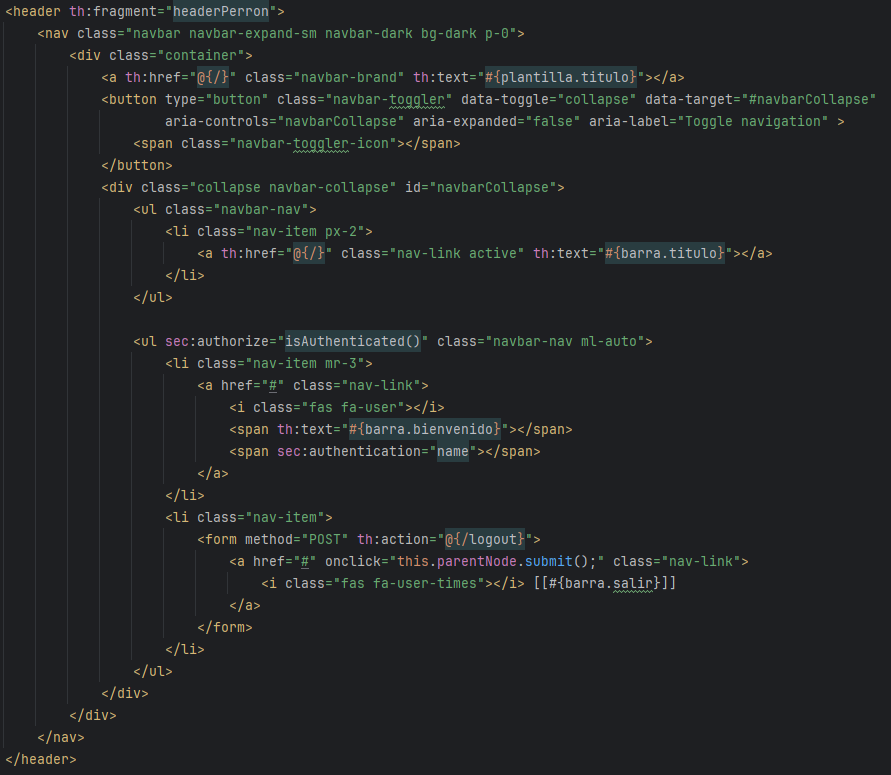

# Seccion 4
## Creacion de Base de Datos

### Creacion de Schema (Base de datos)
- Comenzamos yendo a la pestaña de `Schemas` del lado inferior izquierdo
- Despues presionamos `Create new Schema` en la parte superior, que basicamente es una nueva Base de Datos

- Establecemos un nombre para la base de datos (test), presionamos `Apply`
 

- Nos mostrara la query SQL que se ejecutara, rpesionamos nuevamente en apply

- Ahora ya tenemos la base de datos `test` creada

### Creacion de Tablas
- Desplegamos la base de datos test y sobre `Tables` damos click derecho y presionamos `Create new table`

- Ahora establecemos un nombre `Persona`
- Definimos las columnas de dicha tabla, comenzando por el `Id`
- `PK` - Primary Key
- `NN` - Not Null
- `AI` - Auto Increment

- Agregamos el resto de los campos que queramos en la tabla y presionamos en apply 

- COnfirmamos la sentencia SQL que se ejecutara y presionamos en apply

- Ahora ya podemos ver nuestra tabla con cada uno de sus campos

### Agregar elementos
- Podemos ver el la lista de personas en nuestra tabla dando click derecho y seleccionando `Select Rows`

- A partir de aqui, podemos agregar manualmente los datos en los registros en la parte inferior.
- Una vez agregados presionamos apply

- Confirmamos la query y apply de nuevo 

- Con esto finalizamos la creacion de BD, Tablas y Registros.