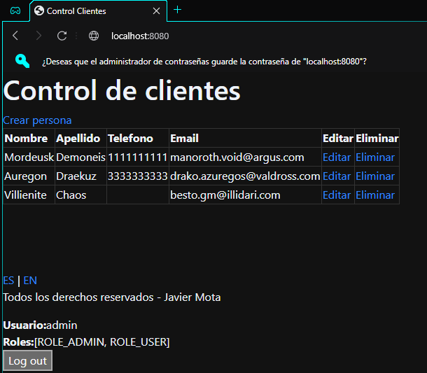

# Seccion 4
## Conexion BD con IDE

### IntelliJ IDEA Ultimate
- Desde la pestaña de `Database`, seleccionamos `+` - `DataSource` y buscamos `MySQL`

- Configuramos el usuario y contraseña
- Agregamos los siguientes parametros a la URL de la DB `?useSSL=false&useTimezone=true&serverTimezone=UTC`
- Es probable que se requiera descar el driver de SQL
- Hacemos un test de conexion y finalizamos

- Una vez agregada la Base de datos, seleccionamos el schema

- Y ahora ya podemos comenzar a hacer consultas

