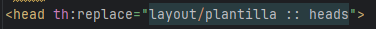
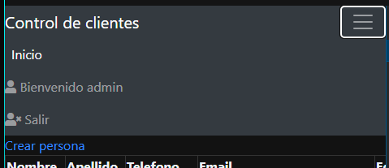
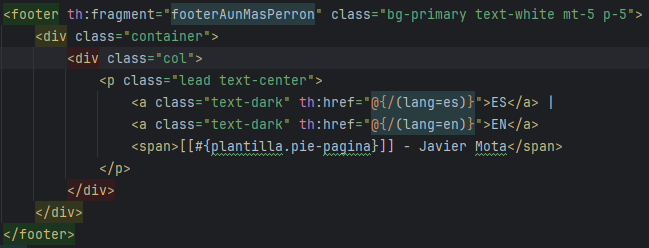

# Universidad Spring
## Instalacion de MySQL

### MySQL Download
- Accedemos a https://dev.mysql.com/downloads/mysql/8.0.html 
- Dado que necesitamos utilizar la version de MySQL Workbench (Interfac de MySQL), descargaremos la version 8.0.X
- Seleccionamos el sistema operativo del ordenador y en caso de ser windows, presionamos en el banner de recomendacion

- Este nos permitira instalar todo lo que necesitemos
- Finalmente, presionamos el boton `Download`

### MySQL Instalador
- Ejecutamos el instalador rpeviamente descargado y seleccionamos la instalacion personalizada y presionamos `Next`

- Desplegamos la pestaña de `MySQL Servers`, seleccionamos la version y la agregamos presionando la flecha verde
 

- Mismo caso para `MySQL Workbench`, que nos permitira administrar las tablas de forma visual. Presionamos `Next`

- Ahora pdoemos observar los productos que estan listos para descargarse, damos click en `Ejecutar` y esperamos a que termine la descarga
- Una vez terminada, presionamos `Next`

- Despues de que se han descargado los productos, nos muestra qu se encuentran listos para instalarse.
- Presionamos `Ejecutar` y una vez Finalizado en `Next`

- Luego nos dice que el servidor requiere algunas configuraciones, presionamos `Next` para configurarlo

- Para las primeras 2 pestañas de configuracion, dejamos por default hasta llegar a la configuracion del password
- Configuramos el password. El resto de configuraciones se dejan por default asi que rpesionamos `Next` hasta finalizar 

### MySQL Workbench
- Es la interfaz grafica de MySQL que nos permite gestionar todo el uso de la base de datos; hacer consultas, crear tablas, modificar registros, etc
- Una vez finalizada la instalacion, se ejecutara `MySQL Workbench` y podremos observar nuestro servidor local

- Para conectarnos a la BD hay que hacer click sobre la misma e introducir la contraseña que no solicita

- Una vez logeados, ya tenemos acceso a los esquemas (BD) y sus tablas.
- De momento es todo y ya podemos empezar a utilizarla

