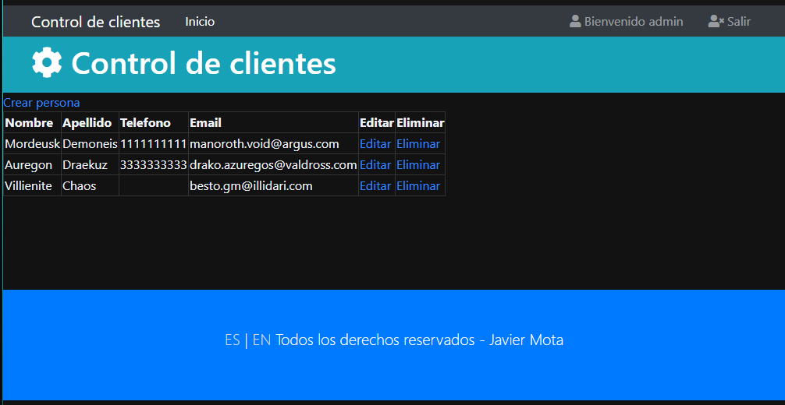
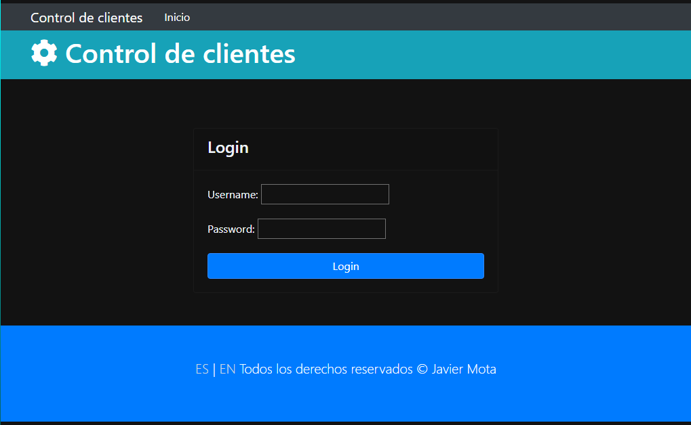
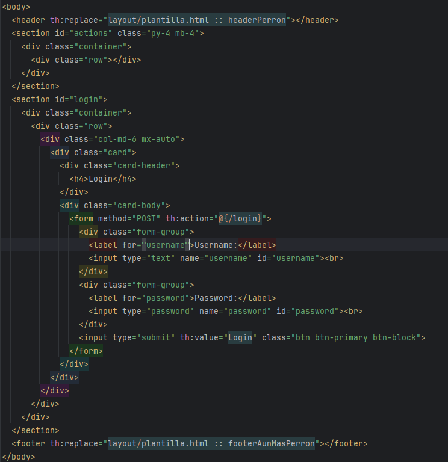
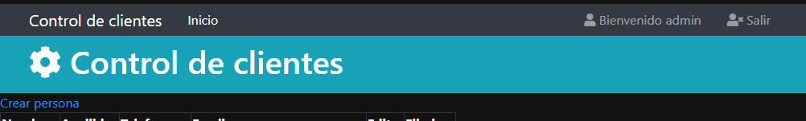
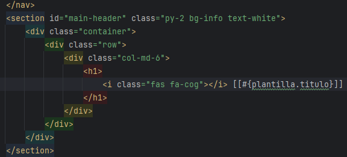
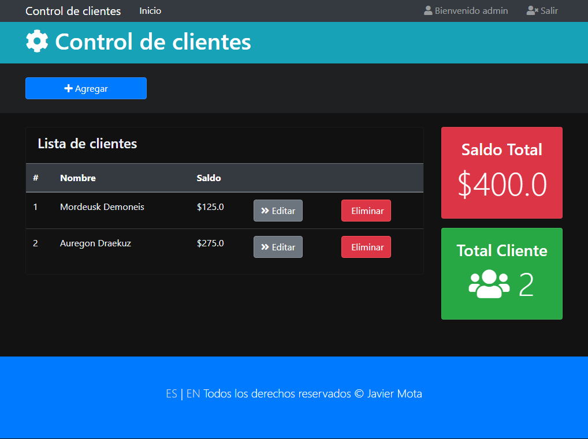
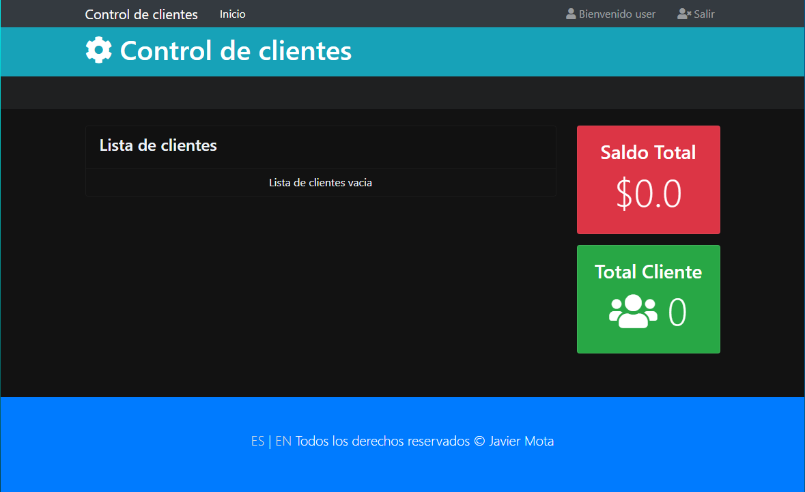

# Seccion 10
## Spring Security

### Libreria Spring Security
- El paso numero 1 para implementar spring security es agregar la libreria al `pom.xml`
- Para ello en el pom seleccionamos la opcion add Starters y buscamos spring security

### Spring Security Default Login
- Una vez hecho esto, podremos observar que al levantar la aplicacion, en automatico ya nos genera un user `user` y una constraseña para pdoer ingresar

- Este es el login por default de spring security

- Ahora solo falta configurar los accesos para los usuarios

### SecurityConfig - Personalizar usuarios de Login
- Sobre el paquete `web` comenzaremos creando una nueva clase llamada `SecurityConfig`
- Dado que es una clase de configuracion de spring, la anotaremos con `Configuration` y `@EnableWebSecurity`
- `SecurityFilterChain` configura las reglas de seguridad
  - Esta configuracion dice que todas las paginas requieren autenticacion
  - Tambien permite el aceso a la pagina de login
- `UserDetailsService` define usuarios en memoria con contraseñas codificadas 
  - Utiliza `passwordEcoder`
  - Estos usuarios se guardan en memoria, pero ams delante se leeran de una base de datos
- Una vez hehco esto, ya no se generara un password al levantar la app dado que ya definimos usuarios
- Asi mismo, tambien generara un mensaje de error si las credenciales son erroneas 

- Ahora podemos logearnos con als credenciales que hemos deifnido el la clase de `SecurityConfig`

### Logout
- Ahora necesitamos configurar un logout para que spring detecte que queremos salir de la aplicacion
- Para esto vamos al `footer` previamente diseñado y agregamos lo siguiente:

- `th:action="@{/logout}"` es el path que spring utiliza para detectar el logout
- Se ha puesto dentro de un boton para que ejecute la accion `submit`
- Ahora podemos nuestro boton desplegado correctamente

- Si lo presionamos, la app de spring nos deslogea y nos informa del status

### Bloqueo de URLs segun el ROLE (admin/user)
- Se han agregador request matchers en `securityConf` para bloquear las urls dependiendo el usuario
- Usar `/eliminar/**` indica que cualquier otro path bajo este mismo (como `/eliminar/132`) tambien estara restringido
- Se va a restringir los paths de editar, eliminar y agregar solo para usuarios de tipo `ADMIN`
  - `Autenticacion`: Agregar usuarios
    - El usuario presenta sus credenciales
  - `Autorizacion`: restriccion de urls
    - Permitir a un usuario visualizar o ejecutar acciones

### WebConfig - AddViewControllers
- Ahora no podremos acceder a la ruta `"/"` dado que esta restringida por el tipo de usuario
- Para esto tendremos que sobreescribir el metodo `addViewController` en la clase `WebConfig`
- Usando `ViewControllerRegistry`, vamos a agregar nuestro path raiz y le daremos el nombre de `index`

### Login personalizado
- De momento se ha configurado la pagina raiz en el `SecurityConfig` pero necesitamos agregar una pagina de login personalizada para que en caso de querer acced a `"/"`, spring security nos redireccione al login si no lo hemos hecho
- Para esto creamos una nueva pagina sobre templates llamada `login`
  - Agregamos los namespaces que ya hemos manejado antes
- Debemos agregar un formulario similar al del logout para setear que valores queremos enviar para el login
  - `method="POST"`
  - `th:action="@{/login}"` para que spring security reconozca este path
- `label` e `input` deben contener `for` y `name` con `username` respetando la sintaxis ya que es lo que espera Spring security
- Mismo caso para el `input` y `label` de `password`
- Finalmente, debemos de hacer el mapeo del login en el `addViewControllers` ya que no agregaremos uno en el controlador normal
  - `AddViewController`: Mapear paths que no pasan por el controlador java
- Agregamos el mapeo en el registry:

- Y lo agregamos en el SecurityConfig: 

- Con esto ya podemos observar nuestro login personalizado

- Esto ya nos permite hacer login como admin y ver todas las opciones disponibles para ese rol

- Pero si logeamos con un usuario que no es admin e intentamos crear un usuario, no marca un `403 Forbidden` debido al rol del usuario

### Error 403 personalizado
- Dentro de templates crearemos una carpeta llamada `errores` y ahi un archivo html `403.html`
- Configuramos cabeceros como en los demas archivos html
- Agregamos un par de mensajes sobre acceso denegado y la opcion de regresar
- Hacemos el mapeo de la ruta en el `addViewController`: 
  - `registry.addViewController("/errores/403").setViewName("errores/403");`
- Agregamos la pagina al security config

- Una vez hecho esto, ya podemos observar nuestra pagina 403 personalizada

- Mas delante, se restringira la visualizacion de las opciones segun el rol.
- Esto permitira desplegar o no acciones permitidas segun el rol, por lo que el usuario de tipo `user` ya no podra ver las opcines de `agregar`, `editar` y `eliminar`

### Recuperar el usuario logeado en el controlador Java
- `@AuthenthicationPrincipal User user` como argumento en el path `"/"` del controlador java, permitira acceder al usuario que acaba de hacer login
- De ommento solo mandaremos a consola el usuario que hizo login para fines demostrativos

### Logout configuration
- Como se ha hecho anteriormente, hay que definir en `SecurityConfig` el path para el logout
- Deifnimos la URL de logout y a donde redirige si el logout es success

### Seguridad con Thymeleaf - Libreria
- Para agregar seguridad en thymeleaf, hay que agregar una libreria mas en el `pom.xml`

### Seguridad con Thymeleaf - Plantillas
- Comenzamos agregando el namespace: `xmlns:sec="http://www.thymeleaf.org/extras/spring-security"`
- Ahora, agregaremos a la plantilla el usuario que hizo login y los roles que tiene ese usuario
- Para ello iremos al footer y agregaremos lo siguiente en el formulario de la plantilla

- Con `sec:authenthication` podemos acceder al nombre de usuario y sus roles, mejor conocidos como `principals`
- Ahora ya podemos visualizar la informacion del usuario en la pantalla

### Thymeleaf Security - oculatr opciones restringidas
- Sobre nuestra pagina de index, agregamos el mismo namespace
- `sec:authorize="hasRole('ROLE_ADMIN')"` sobre cada link que ejecuta las acciones que queremos restringir y ya no se deben mostrar para usuarios de tipo `ROLE_USER`
- Ahora pdoemos observar como no se tiene acceso a las opciones para un usuario que no es admin

### Highlights
- Cons spring security, es necesario agregar al `addViewController` las rutas que no pasan por un controlador java
- `SecurityConfig` debe tener configurados los paths de `login`, `logout` y `errores`