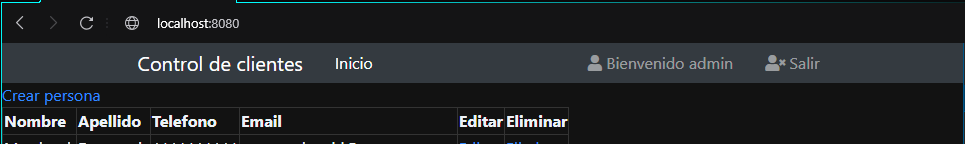
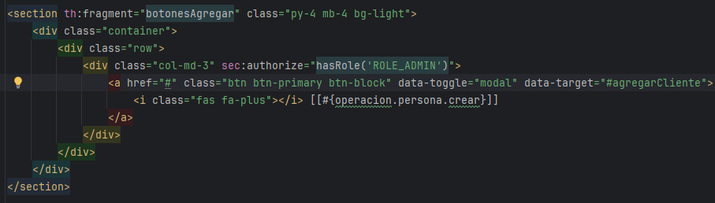

# Seccion 11
## Spring Security con JPA y Hibernate

### MySQL Workbench - Nuevas tablas
- Agregaremos las tablas de `Usuarios` y `Roles` para recuperar esta informaciond e la base de datos
- Esto permitira eliminar el codigo duro de los usuarios del proyecto
- Creamos las tablas con las siguientes especificaciones:
- `Usuario`

- Debido a que el password viene encriptado, el campo debera ser un `VARCHAR` mas extenso

- `Rol`

- Esta tabla debe contener la llave foranea de la tabla de usuario `id_user`
- Esto se configura en la pestaña de `foreign key` despues de agregarla como columna
- De damos un nombre a la llave foranea y seleccionamos la tabla con la que se relaciona
- Del otro lado seleccionamos el campo con el que tien relacion, en ese caso `id_user` y aplicamos cambios

- Por ultimo agregamos nuevos usuarios y roles similar a lo actualmente configurado en el proyecto
- El usuario 1 tendra los roles de `ROLE_ADMIN`  y `ROLE_USER`, por lo que se configuran 2 registros en la tabla `rol`

### Encriptacion de password
- Lo primero es crear una clase de utileria para generar los passwords que usaremos en la BD
- Creamos una nueva clase `EncriptarPassword` en el paquete denuvo `.utils`
- El algoritmo a utilizar es `BCryptPassword`, entonces creamos una instancia de `BCryptPasswordEncoder` dentro de nuestra clase de utileria
  - Esta es una clase de spring, por lo que hay que importarla de la libreria de spring
- Despues creamos un password cualquiera `123`
- Ahora necesitamos un metodo llamado `encriptarPassword`
  - Recibe la cadena, usa el encoder con su metodo `encode` y retorna el password encriptado
- Asi luce la clase de utileria para la encriptacion

- Asi luce el password encriptado

- Una vez encriptado el password, se puede modificar manualmente en la base de datos

### Mapeo de nuevas tablas Usuario y Rol
- Debemos crear las clases de entidad para `usuario` y `rol` dentro del paquete de `entity` de forma similar coo lo hicimos con las clase `persona`
- En las clase `Rol` no es necesario mapear la llave foranea `idUsuario` ya que en este lado de la relacion no es necesario agregarla
- Por el contrario, la clase de usuario debe mapear el campo con el que se relaciona con la tabla rol
  - Se utiliza `@OneToMany` para definir que es una relacion de uno a mucho, un usuario puede tener muchos roles
  - Se utiliza `@JoinColumn(name="id_usuario")` indica cual es la columna que hace la relacion entre las tablas
- Dado que pueden ser mucho roles, definimos una lista de objetos de tipo `Rol`

- Con esto ya tenemos roda la informacion que requerimos para trabajar con nuestra clase `Usuario` y `Rol`

### Spring Security con JPA - UsuarioRepository y UsuarioService
- Debemos crear las clases `repository` para `Usuario` y `Rol`
- Comenzando con la de `Usuario`, en esta ocasion se extendera de `JapRespoitory...` en lugar de `CrudRepository` dado que contiene algunas mejoras
- Tambien debemos definir un metodo personalizado `finByUsername(string username)`
  - Este tipo de tipado permite hacer queries sin usar el modo nativo
    - `findByUsername` = `SELECT * FROM usuario WHERE nombre = username` 
  - Spring va a recuperar un objeto de tipo usuario filtrado por el `username`

- Ahora debemos crear su respectiva clase de servicio `UsuarioService` sobre el paquete de `servicio`
- Debemos anotar este servicio y renombrar el bean `@Service("userDetailsService")`
  - Spring en automatico va a buscar un bean con este nombre, por eso es importante no cambiarlo
- Agregamos el manejo de logeo con `@Slfj4`
- Esta clase debe implementar `UserDetailsService` para que pueda funcionar la seguridad de spring cuando trabajamos con esta implementacion de JPA
- Esta interface tiene el metodo `loadUserByUsername` que obtiene un usuario filtrado por su username
  - la implementacion de este metodo se apoyara del repositorio para buscar el usuario en la BD
  - Por lo que debemos de agregarlo como atributo de clase
- Para comenzar recuperaremos el objeto de usuario del repositorio con el argumento pasado al metodo
- Despues hacemos una validacion del registro por si es que no lo encontramos
  - De no encontrarlo, arrojamos una exception con el nombre de usuario que no se encontro
- Mas delante, recuperamos los roles desde nuestro objeto usuario
  - No podemos utilizar nuestra clase de rol directamente
  - Spring utiliza el tipo `GrantedAuthority` para manejar los roles, asi que debemos envolver nuestros roles en este tipo de dato
- Despues debemos de iterar `usuario.roles` y los envolvemos en un nuevo objetod e tipo `SimpleGrantedAuthority`
  - `SimplegrantedAuthority` es el objeto que implementa `GrantedAuthority`
- Finalmente debemos retornar el objeto del metodo con todos los valores que ya hemos recuperado
  - `User` es una clase de spring security que implementa `UserDetails` asi que podemos suarla en el return
  - Este user tiene los siguientes campos:
    - `username`: Lo obtenemos desde el repositorio
    - `password`: Tambien viene de la llamada del repositorio
    - `collection<GrantedAuthority>`: Iteramos nuestros roles y lo alacenamos en una lista

- Esto es todo lo que necesitamos para que Spring security carge la informacion de un usuario

### SecurityConfig
- Anteriormente definimos los usuarios en memoria en la clase de `SecurityConfig`
- Ahora modificaremos la implementacion para que los carge usando JPA
- Comenzaremos inyectando el `UsuarioService` que trabajamos previamente
  - Al igual que con el `PersonaService`, inyectamos la interfaz en lugar de la clase de implementacion, por lo que inyectaremos `UserDetailsService` que es la interfaz que spring utiliza para la recuperacion de usuarios
- Despue definiremos el tipo de encipcion que vamos a utilizar
  - Anteriormente utilizamos `BCryptPasswordEncoder` para encriptar los passwords
  - Asi lo que agregaremos como un bean para que spring pueda usarlo para desencriptar 
    - Anotamos el metodo con `@Bean` para que spring lo agregue al contenedor y pueda ser utilizado 

- Ahora necesitamos un nuevo metodo para definir que haremos uso del `passwordEnconder` y de nuestra clase `userDetailsService`
- A este metodo se le pasara un argumento de forma automatica mediante spring
- Al anotar el metodo con `@Autowired` spring va a buscar automaticamente una implementacion de `AuthenthicationManagerBuilder`
  - Al trabajar con Spring security, `AuthenthicationManagerBuilder` es un objeto que ya se encuentra en la fabrica de spring
  - Ahora sobreescribimos en el objeto `build` el `UserDetailsService` y el `passwordEncoder` con los que nosotros definimos

- Ahora nos pdoemos deshacer de nuestra vieja implementacion donde creabamos los usuarios hardcodeados

### Resolucion de errores
- `Error creating bean with name 'securityConfig': Requested bean is currently in creation`
  - basta con eliminar la anotacion `@Bean` del `passwordEncoder` en `SecurityConfig`
- Si hibernate tiene problemas con la identificacion de nombre de columna:
  - Asegurese de que el nombre de la columna corresponda al nombre de la entidad en java
- `failed to lazily initialize a collection of role: com.courses.je.model.entity.Usuario.roles: could not initialize proxy - no Session`
  - Si siempre necesitas la colección, puedes configurarla como FetchType.EAGER en la relación ` @OneToMany(fetch = FetchType.EAGER)`
  - Otra solucion es agregar `@Transactional` a `loadUserByUsername` en `UsuarioService`

### Aplicacion
- Una vez configurado el proyecto y los errores resueltos, podemos acceder a nuestra aplicaicon como anteriormente lo haciamos solo que ahora las credenciales no estan almacenadas en memoria si no en una base de datos
- Login

- Pantalla de `admin` con todas las opciones disponibles 

- Panatlla de `user` con las opciones restringidas

